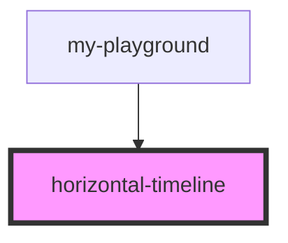

# horizontal-timeline

<!-- Auto Generated Below -->

## Properties

| Property              | Attribute  | Description | Type                                                 | Default     |
| --------------------- | ---------- | ----------- | ---------------------------------------------------- | ----------- |
| `points` _(required)_ | --         |             | `{ name: string; active?: boolean \| undefined; }[]` | `undefined` |
| `position`            | `position` |             | `number \| string`                                   | `0`         |

## Dependencies

### Used by

 - [my-playground](../my-playground)

### Graph

----------------------------------------------

*Built with [StencilJS](https://stenciljs.com/)*
