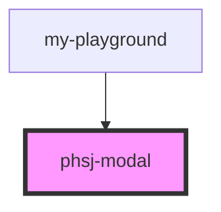

# phsj-modal

<!-- Auto Generated Below -->

## Properties

| Property             | Attribute | Description | Type     | Default     |
| -------------------- | --------- | ----------- | -------- | ----------- |
| `title` _(required)_ | `title`   |             | `string` | `undefined` |

## Events

| Event     | Description | Type                   |
| --------- | ----------- | ---------------------- |
| `isClose` |             | `CustomEvent<boolean>` |

## Dependencies

### Used by

 - [my-playground](../my-playground)

### Graph

----------------------------------------------

*Built with [StencilJS](https://stenciljs.com/)*
